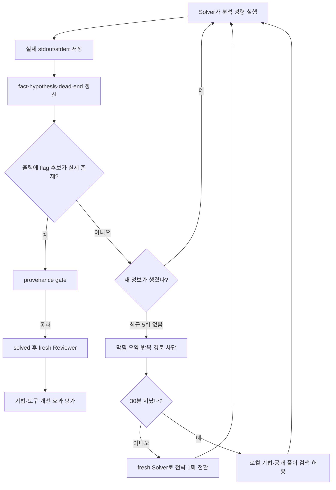

# Hermes CTF Reverse Harness 비교·개선 보고서

조사일: 2026-08-24  
대상: 현재 `C:\Users\ytyt\Desktop\security\ctf`의 Pi 기반 리버싱 CTF 하네스

## 1. 결론부터

현재 하네스의 방향은 좋다. 특히 **호스트와 문제 바이너리의 분리**, **명령마다 폐기되는 네트워크 차단 Docker worker**, **실제 플래그의 Git 차단**, **30분 전 공개 풀이 검색 금지**, **풀이와 Reviewer 컨텍스트 분리**는 조사한 프로젝트 상당수보다 명확하다.

지금 가장 부족한 것은 에이전트 수나 도구 수가 아니다. 핵심 결손은 다음 네 가지다.

1. 풀이 도중 **무엇을 가정했고 무엇이 틀렸는지** 구조적으로 남기지 않는다.
2. 같은 명령·가설을 반복해도 **막힘(stall)을 자동으로 감지하지 않는다**.
3. 플래그 문자열을 기록하면 즉시 `solved`가 되어, **실제 실행 결과에 근거했다는 증거 연결**이 없다.
4. Pi Solver 프로세스에는 명령별 timeout 외에 **턴·비용·전체 실행 예산과 명확한 종료 사유**가 없다.

따라서 다음 버전은 Muteki처럼 거대한 swarm을 만드는 대신, 현재 `progress.md` 하나에 `hypotheses`, `dead_ends`, `flag_evidence`, `exit_reason`만 추가하고, 일정 횟수 동안 새 증거가 없으면 기존 Solver를 끝내고 **요약된 상태를 받은 새 Solver/Reviewer로 한 번 전환**하는 것이 가장 효율적이다.

## 2. 현재 하네스 기준선

현재 구현은 다음 흐름이다.

1. 부모 Pi에서 문제를 가져오고 `runs/<challenge_id>/`에 저장한다.
2. `ctf_solve`가 `--no-session`인 독립 Pi Solver를 실행한다.
3. Solver는 `core → dynamic → 선택 함수만 ghidra → angr` 순서를 우선한다.
4. 실제 바이너리 분석 명령은 명령마다 새 Docker 컨테이너에서 실행된다.
5. 각 명령의 stdout/stderr와 명령 이력은 run 폴더와 `progress.md`에 남는다.
6. 30분 전에는 공개 풀이와 로컬 기법 메모리를 검색하지 않는다.
7. 해결, 미해결 또는 30분 초과 상태에서 새 컨텍스트의 Reviewer가 실행된다.
8. Reviewer는 검증, 더 빠른 풀이, 도구 제안을 `reports/review.md`에 남긴다.
9. 실제 플래그와 비공개 write-up은 Git에서 제외하고 공개 write-up은 플래그를 제거한다.

### 잘 설계된 부분

- `DockerWorker`는 `--network none`, `--read-only`, `--cap-drop ALL`, `no-new-privileges`, PID·CPU·메모리 제한을 기본 적용한다.
- 동적 분석 프로필에만 `SYS_PTRACE`를 추가한다.
- 원본은 읽기 전용, work/output만 쓰기 가능하다.
- Solver와 Reviewer가 부모 대화 컨텍스트를 계속 소비하지 않는다.
- Pi에 등록된 자식 도구를 역할별 allowlist로 제한하고, 자식이 브라우저나 다른 에이전트를 재귀 호출하지 못하게 한다.
- TUI에는 현재 도구, 성공·실패, 경과시간, 턴 수가 표시된다.
- Ghidra 전체 디컴파일을 피하고 관심 함수만 묶어 요청한다.
- 쉬운 문제의 모든 풀이를 무조건 메모리에 넣지 않고, 30분 초과·미해결 문제만 기법 카드 후보로 만든다.
- 서버 없는 정적 `dashboard.html`만 생성한다.

### 현재 피드백 루프의 실제 한계

현재 루프는 엄밀히 말하면 **사후 리뷰 루프**다. Solver가 끝나기 전에는 Reviewer가 개입하지 않으며, Reviewer의 피드백이 같은 run의 다음 Solver 행동으로 자동 연결되지 않는다.

또한 `progress.md`에는 명령, exit code, blocker가 있지만 다음은 없다.

- 현재 가설과 그 근거
- 반증된 접근과 반복 금지 이유
- 명령 결과에서 새로 얻은 사실
- 플래그 후보가 어느 명령 출력에서 나온 것인지
- 종료가 해결, 비용, 턴, timeout, 반복, 에러 중 무엇 때문인지

이 때문에 에이전트가 새 컨텍스트로 바뀌어도 로그 전체를 다시 읽어야 하고, 막힌 접근을 다시 시도할 가능성이 높다.

### 코드 수준에서 먼저 바로잡아야 할 점

- 분석 명령 하나가 non-zero이면 전체 상태가 `failed`가 된다. CTF 분석에서 `grep` 결과 없음, 잘못된 함수 주소, 디버거 종료 같은 개별 실패는 정상적인 탐색 결과이므로 **명령 실패와 run 실패를 분리**해야 한다.
- Solver가 exit code 0으로 끝났지만 상태가 `solving`인 경우, 현재 `ctf_solve`는 terminal state가 아닌데도 성공 결과를 반환할 수 있다.
- 반대로 Solver 프로세스가 실패해도 Reviewer가 성공하면 전체 실패 판단이 희석될 수 있다. Reviewer 성공은 Solver 실행 오류를 복구했다는 뜻이 아니다.
- `ctf_record_flag`는 비어 있지 않은 임의 문자열을 받으면 즉시 `solved`로 바꾼다. Reviewer가 나중에 확인하더라도 이미 terminal state가 잘못 기록될 수 있다.
- Docker 명령 timeout은 있지만 Pi Solver의 최대 턴, 최대 비용, 최대 전체 시간은 없다.

## 3. 비교 대상과 선정 기준

GitHub 별 수는 변동하는 참고 지표일 뿐이다. 아래 수치는 2026-08-24 GitHub 공개 메타데이터 스냅샷이며, SWE-agent의 별 수는 EnIGMA 기능만이 아니라 저장소 전체 인기도다.

| 프로젝트 | 현재 참고 인기도 | 선정 이유 |
|---|---:|---|
| [ljagiello/ctf-skills](https://github.com/ljagiello/ctf-skills) | 3,063 stars / 357 forks | 가장 널리 퍼진 CTF Agent Skills형 지식·라우팅 구조 |
| [SWE-agent/SWE-agent, EnIGMA v0.7](https://github.com/SWE-agent/SWE-agent/releases/tag/v0.7.0) | 20,112 / 2,204 | 대규모 CTF 평가와 interactive debugger 도구를 갖춘 연구 하네스 |
| [NYU-LLM-CTF/nyuctf_agents, D-CIPHER](https://github.com/NYU-LLM-CTF/nyuctf_agents) | 159 / 31 | 인기도보다 Planner–Executor 피드백 루프의 코드·논문 근거 때문에 포함 |
| [aliasrobotics/cai](https://github.com/aliasrobotics/cai) | 9,797 / 1,431 | 보안 에이전트 orchestration, handoff, HITL, 예산·컨텍스트 관리 사례 |
| [FishCodeTech/muteki](https://github.com/FishCodeTech/muteki) | 398 / 47 | Pi를 포함한 이기종 CLI agent swarm과 dead-end/증거 blackboard의 최신 사례 |

CAI는 2026-08-22 archive되어 더 이상 수정·보안 패치를 제공하지 않는다. 따라서 의존 대상으로 채택하기보다 설계 패턴만 참고해야 한다.

## 4. 프로젝트별 상세 비교

### 4.1 ctf-skills: 좋은 플레이북, 약한 런타임 피드백

`ctf-skills`의 중심은 실행 엔진보다 **카테고리별 지식 패키지와 dispatcher**다. `solve-challenge`는 파일·서비스를 triage한 뒤 web, pwn, crypto, reverse 등 전문 skill로 보낸다. 막히면 가정을 다시 보고, 다른 카테고리 skill로 pivot하고, 놓친 파일·포트·메타데이터를 찾고, 단순한 우회 경로와 edge case를 보라고 지시한다. 플래그 후보가 여러 개면 의도된 artifact와 연결하고 전체 파일에서 유일성을 확인하도록 한다. 이 흐름은 공개된 [`solve-challenge/SKILL.md`](https://github.com/ljagiello/ctf-skills/blob/main/solve-challenge/SKILL.md)에 명시돼 있다.

피드백 루프는 대부분 자연어 지침이다.

- 첫 접근 실패 → 가정 재검토
- 복합 문제 가능성 → 다른 category skill 호출
- 여러 플래그 후보 → 출처와 유일성 확인
- 해결 → 별도 write-up skill 호출

하지만 자체적으로 라운드·비용·반복 명령·dead-end를 추적하거나, 플래그가 실제 명령 출력에 존재했는지 강제하는 runtime은 아니다. README가 소개하는 Friday Studio를 사용하면 재현 가능한 workspace, logging, memory를 붙일 수 있지만, 저장소 자체의 핵심은 여전히 skill corpus다. [프로젝트 README](https://github.com/ljagiello/ctf-skills/blob/main/README.md)

우리와의 차이:

- 상대가 강함: 분야 범위와 기법 지식, 카테고리 전환, 설치 스크립트, Agent Skills 호환성.
- 우리가 강함: 실제 상태 저장, 격리된 실행, 플래그 비공개 처리, 30분 검색 gate, 자동 Reviewer.
- 가져올 것: `reverse` skill 전체를 복사하지 말고, triage 결과에 따라 필요한 체크리스트 일부만 Solver prompt 또는 로컬 technique card로 가져오는 방식.
- 가져오지 않을 것: 모든 분야 도구를 한 이미지에 preinstall하는 방식. 현재 reversing 전용 이미지 분리를 유지한다.

### 4.2 EnIGMA: 실제 상호작용이 막힘과 환각을 줄인다

EnIGMA는 SWE-agent v0.7에 CTF 지원을 추가하면서 stateful `gdb`와 server connection 같은 **Interactive Agent Tools**, 긴 출력용 summarizer, 명령 timeout 설정을 도입했다. 공식 릴리스에는 스크롤 반복 경고와 context-window 오류 처리도 포함돼 있다. [EnIGMA v0.7 릴리스](https://github.com/SWE-agent/SWE-agent/releases/tag/v0.7.0)

연구의 중요한 관찰은 `soliloquizing`이다. 모델이 실제 환경과 상호작용하지 않고 관찰 결과를 스스로 만들어내는 현상이다. 논문은 390개 CTF 문제 평가에서 interactive tools가 성능을 실질적으로 높였다고 보고한다. [EnIGMA 논문](https://arxiv.org/abs/2409.16165)

막힌 문제에 대한 접근:

- 디버거·원격 연결을 하나의 지속 세션으로 다룬다.
- 긴 출력은 잘라 버리는 것만이 아니라 요약해 다음 행동에 전달한다.
- 개발 중 실패한 trajectory도 guideline/demonstration을 만드는 데 활용한다.
- 실제 도구 관찰을 반복적으로 모델에 반환해 자기 생성 관찰을 줄인다.

우리와의 차이:

- 상대가 강함: stateful GDB, 긴 출력 요약, 연구 benchmark, 실제 상호작용 중심 설계.
- 우리가 강함: 명령마다 깨끗한 폐기 worker, 세분화된 이미지, 기본 네트워크 차단, 플래그 Git 안전성.
- 가져올 것: 우선 `gdb -batch -ex ...` 명령 스크립트로 재현 가능한 디버깅을 강화하고, 정말 필요한 문제가 반복해서 확인될 때만 challenge별 persistent dynamic session을 추가한다.
- 즉시 가져오지 않을 것: 모든 분석을 stateful container로 바꾸는 것. 재현성과 격리가 약해지고 현재 구조의 장점이 사라진다.

### 4.3 D-CIPHER: Planner가 새 Executor의 결과를 받아 다음 계획을 고친다

D-CIPHER는 single-agent의 한 개 reasoning-action loop가 복잡한 CTF에서 부족하다고 보고, Planner와 여러 heterogeneous Executor, Auto-prompter를 둔다. 논문은 이를 dynamic feedback loop로 설명한다. [D-CIPHER 논문](https://arxiv.org/abs/2502.10931)

공개 코드에서 확인되는 핵심은 다음과 같다.

- 기본 SingleAgent는 최대 30 rounds와 최대 비용을 가진다.
- Planner가 작은 작업을 만들고 Executor는 **새 conversation**에서 그 작업만 수행한다.
- Executor가 `FinishTask`로 요약을 돌려주면 Planner가 그 결과를 보고 다음 작업을 정한다.
- Executor가 정상 요약을 못 내면 한 번 더 summary를 요구하고, 그래도 실패하면 빈 결과·오류를 구분해 반환한다.
- 종료 사유를 `solved`, `giveup`, `cost`, `planner_rounds`, `error`, `unknown`으로 기록한다.
- 전체 대화는 로그에 남기되 모델 입력에는 최근 observation 수만 유지하고, observation은 최대 25,000자로 자른다.

이는 [`agent.py`](https://github.com/NYU-LLM-CTF/nyuctf_agents/blob/main/nyuctf_multiagent/agent.py)와 [`conversation.py`](https://github.com/NYU-LLM-CTF/nyuctf_agents/blob/main/nyuctf_multiagent/conversation.py)에서 확인된다.

우리와의 차이:

- 상대가 강함: 명시적 round/cost/exit reason, 작은 작업별 fresh Executor, 실패한 Executor의 결과도 Planner 피드백으로 환원.
- 우리가 강함: 훨씬 단순한 코드와 운영, 강한 Docker 정책, reversing 전용 도구 분리, private/public write-up 분리.
- 가져올 것: 전체 Planner–Executor 클래스를 복제할 필요 없이, **막힘 발생 시 현재 상태를 1회 요약해 fresh Solver에게 넘기는 구조**와 명시적 종료 사유만 가져온다.
- 가져오지 않을 것: 현재 단계에서 Auto-prompter와 모델별 heterogeneous Executor. 프롬프트 최적화 비용과 인스턴스 수가 현재 문제보다 크다.

### 4.4 CAI: 운영자가 중간에 조향할 수 있는 범용 보안 프레임워크

CAI는 Agent, Tools, Handoffs, Patterns, Turns, Tracing, Guardrails, HITL을 중심으로 LLM orchestration과 코드 orchestration을 혼합한다. agent를 tool처럼 독립 실행하거나 specialist에게 handoff할 수 있고, deterministic chain·judge feedback·parallel specialist 같은 패턴을 제공한다. [CAI multi-agent 문서](https://aliasrobotics.github.io/cai/multi_agent/)

실행 루프에는 `max_turns` 예외가 있고, 설정에는 turn·interaction·가격 제한이 있다. 컨텍스트는 `/history`, `/compact`, `/save`, `/load`, `/flush`, `/memory`로 운영할 수 있다. [실행 루프](https://aliasrobotics.github.io/cai/running_agents/), [명령 문서](https://aliasrobotics.github.io/cai/tui/commands_reference/)

막힌 문제에서 유용한 부분:

- 에이전트를 완전히 죽이지 않고 사람이 history를 보고 방향을 바꿀 수 있는 HITL.
- handoff input filter로 다음 agent에 불필요한 tool history를 제거할 수 있다.
- turn, interaction, cost를 각각 제한한다.
- 저장한 JSONL을 다시 context로 로드하거나 긴 대화를 compact할 수 있다.
- LLM judge가 결과를 검토하고 기준을 통과할 때까지 feedback할 수 있다.

우리와의 차이:

- 상대가 강함: 운영자 조향, 다양한 handoff 패턴, 비용·context 관리, 범용성.
- 우리가 강함: 목적이 좁고 코드가 작으며 실행 정책이 명백하다. CAI처럼 trace·pattern·provider 추상화를 운영할 필요가 없다.
- 가져올 것: TUI에서 현재 Solver를 취소한 뒤 사용자의 한 줄 지시를 `progress.md`에 넣고 fresh Solver로 재시작하는 최소 steering.
- 가져오지 않을 것: OpenTelemetry/Phoenix급 tracing, 범용 agent registry, 복잡한 pattern 계층. CAI 자체가 archive되었으므로 코드 의존도 피한다. [CAI archive 안내](https://github.com/aliasrobotics/cai)

### 4.5 Muteki: dead-end와 증거 출처가 핵심인 이기종 swarm

Muteki는 Claude, Codex, Cursor, Pi, OpenCode 등 여러 CLI agent를 같은 문제에 투입하고 SQLite blackboard로 협업시킨다. blackboard에는 Facts, Intents, Dead-ends, Flags, PoCs가 있으며 worker는 실행 전에 기존 사실·dead-end를 읽고, 하나의 intent를 claim한 뒤 결과를 되돌린다. [Muteki 동작 원리](https://github.com/FishCodeTech/muteki/blob/main/docs/%E5%B7%A5%E4%BD%9C%E5%8E%9F%E7%90%86.md)

피드백 루프와 미해결 처리에서 가장 참고할 점이 많다.

- Coordinator는 blackboard가 바뀐 경우에만 재계획해 빈 호출을 줄인다.
- dead-end를 사실과 동등하게 기록하여 다른 worker가 같은 길을 반복하지 않게 한다.
- Review worker는 주 풀이를 막지 않는 병렬 경로에서 의심스러운 fact와 중복 route를 검토한다.
- flag는 형식이 맞는 것만으로 부족하고 **실제 명령 출력에 동일 문자열이 존재해야** gate를 통과한다.
- worker가 구조화된 결과를 못 내면 conclude 호출을 최대 한 번만 더 한다.
- budget 소진, 무출력 반복, 운영자 명령을 Guard가 감시한다.
- CTF는 해답이 있다는 가정 아래 무한 재시도하지 않고, 여러 worker가 연속으로 무성과이면 soft pause하여 사람을 기다린다.
- 정상 해결, 사용자 중단, crash 모두 idempotent Finalize로 끝내 terminal event를 하나만 낸다.

우리와의 차이:

- 상대가 강함: 공유 dead-end, 실행 증거 gate, 여러 모델의 상호 보완, lease와 intent 중복 방지, 실시간 review.
- 우리가 강함: 훨씬 적은 프로세스·토큰·운영 복잡도, 한 문제 한 Solver의 추적 용이성, 기본 networkless worker, host 실행 차단, 작은 Docker 프로필. Muteki의 로컬 worker는 강한 격리를 보장하지 않고 worker가 도구 설치도 할 수 있다.
- 가져올 것: blackboard 전체가 아니라 `progress.md`에 검증된 facts/dead-ends와 flag evidence를 넣는 것.
- 가져오지 않을 것: 2초 OODA, SSE/JSONL event bus, 최대 10 worker, intent lease, heterogeneous model race. 지금 사용자 요구인 “최대한 미니멀”과 충돌한다.

## 5. 한눈에 보는 구조 비교

| 항목 | Hermes 현재 | ctf-skills | EnIGMA | D-CIPHER | CAI | Muteki |
|---|---|---|---|---|---|---|
| 기본 단위 | Pi Solver 1 + 사후 Reviewer | skill dispatcher | ReAct agent | Planner + fresh Executors | 범용 agent/handoff | Coordinator + 다수 worker |
| 실행 피드백 | 도구 stdout/stderr | 자연어 절차 | interactive 도구 observation | Executor 요약 → Planner | tool/handoff/judge | fact/dead-end → blackboard → 재계획 |
| 막힘 감지 | 30분과 수동 unsolved | 프롬프트상 pivot | interaction·output 관리 | round/cost/giveup | turn/cost/HITL | no-output, dead-end, budget, operator |
| 반복 억제 | 없음 | 지침만 있음 | 제한적 경고·trajectory | 새 task 분해 | context 조작 가능 | dead-end/route/intent claim |
| 플래그 근거 | 문자열 기록 즉시 solved | 출처·유일성 지침 | 환경 interaction | 응답·observation 검사 | 패턴별 구현 | 실제 명령 출력 provenance gate |
| 컨텍스트 | child fresh, run 로그 | skill on demand | summarizer | 최근 observation만 전달 | compact/load/filter | blackboard 공유 |
| 장기 학습 | 어려운 문제의 FTS 카드 | skill 지식 갱신 | 실패 trajectory/guideline | 로그·실험 중심 | memory/load | run blackboard 중심 |
| 실행 격리 | 매우 강함 | 런타임에 의존 | sandbox/container | challenge container | 설정에 의존 | local은 약함, container 선택 |
| 운영 복잡도 | 낮음 | 매우 낮음 | 중간 | 중간~높음 | 높음 | 매우 높음 |

## 6. 우리에게만 있거나 특히 강한 점

### 6.1 명령 단위 폐기 worker

조사 대상은 장시간 container/session 또는 host worker를 사용하는 경우가 많다. 현재 구조는 오염된 파일, 환경 변경, 프로세스 잔존을 다음 명령으로 넘기지 않는다. 리버싱에서 재현 가능한 명령을 강제한다는 점도 장점이다.

### 6.2 네트워크 없는 분석과 로그인 브라우저의 분리

사용자가 로그인한 Playwright browser는 부모 Pi에 있고, 바이너리를 실행하는 worker는 네트워크가 없다. challenge 페이지 접근과 untrusted artifact 실행을 같은 권한 영역에 섞지 않는 구조다.

### 6.3 Git-safe 플래그·write-up 정책

실제 플래그와 비공개 write-up은 run 안에 두고, 공개 write-up에는 flag-like 값을 제거한다. `ctf-skills`나 연구용 benchmark agent보다 개인 Git workflow에 더 직접 맞는다.

### 6.4 공개 풀이 검색의 시간 gate

기법 검색을 처음부터 허용하지 않고 30분 뒤 또는 미해결일 때만 연다. solve rate만 최적화하는 하네스와 달리 학습 목적과 데이터 누출 방지를 동시에 고려한다.

### 6.5 선택적인 학습 메모리

모든 문제의 장문 대화를 넣지 않고 어려웠던 문제의 재사용 기법만 카드로 만든다. memory가 쉬운 문제와 플래그로 오염되는 것을 줄인다.

### 6.6 작고 이해 가능한 orchestration

현재 핵심은 TypeScript extension 한 개, 짧은 Solver/Reviewer prompt, 작은 Python 실행 계층이다. 문제를 재현하거나 정책을 확인할 때 거대한 coordinator와 event system을 따라갈 필요가 없다.

## 7. 보완 우선순위

### P0 — 다음 기능보다 먼저 고칠 정합성

#### P0-1. 명령 결과와 run 상태 분리

개별 명령 non-zero는 `tool_runs[n].exit_code`에만 남기고 run 상태를 바로 `failed`로 바꾸지 않는다. `failed`는 Docker/Pi 자체 장애처럼 풀이를 지속할 수 없는 경우에만 쓴다.

#### P0-2. terminal state를 성공 조건으로 강제

`ctf_solve` 완료 조건을 다음처럼 단순하게 만든다.

- `solved`: 성공
- `unsolved`: 정상 종료지만 미해결
- `failed`: 인프라/agent 실패
- 그 외 상태로 child가 종료: `incomplete`

Reviewer가 성공해도 Solver 프로세스 오류를 숨기지 않는다.

#### P0-3. 플래그 provenance gate

`ctf_record_flag(challenge_id, value, evidence_run)` 형태로 바꾸고 해당 `evidence_run`의 stdout/stderr 원문에 같은 문자열이 있을 때만 `solved`로 전환한다. 출력에 없는 값은 `flag_candidates`에 후보로만 보관한다.

정적 분석에서 스크립트가 플래그를 직접 출력하지 않고 로직만 증명한 경우를 위해 `evidence_run`과 `verification_note`를 함께 요구하되, note만으로 자동 solved는 허용하지 않는다. 검증 스크립트를 worker에서 실행해 후보가 출력되도록 하는 편이 재현 가능하다.

### P1 — 최소 피드백 루프

#### P1-1. `progress.md`에 facts, hypotheses, dead-ends 추가

새 DB나 `events.jsonl`을 만들지 않는다. 기존 hidden JSON에 다음 정도만 둔다.

```json
{
  "facts": [{"text": "check_flag compares 16 transformed bytes", "evidence_run": 7}],
  "hypotheses": [{"text": "input is XORed with 0x37", "status": "testing"}],
  "dead_ends": [{"text": "UPX unpack path", "reason": "not packed; section layout normal", "evidence_run": 3}],
  "exit_reason": null
}
```

에이전트가 매 명령마다 장황하게 쓰게 하지 말고, 전략이 바뀌거나 사실이 검증될 때만 업데이트한다.

#### P1-2. 시간뿐 아니라 novelty 기반 stall 감지

다음 중 하나면 막힘으로 본다.

- 정규화한 동일 명령을 2회 이상 반복
- 최근 5개 분석 명령 동안 새 fact/artifact/hypothesis 변화 없음
- 같은 exit code와 유사한 출력 hash를 가진 명령 변형 반복
- Solver가 tool call 없이 결론만 반복

첫 감지에서는 짧은 경고를 Solver 컨텍스트에 넣는다. 두 번째 감지에서는 Solver를 종료하고 fresh Reviewer가 `facts`, `dead_ends`, blocker만 읽어 다음 1~3개 전략을 작성한다. 이후 fresh Solver가 그 요약을 받아 한 번 재시도한다.

#### P1-3. 오류 재시도와 전략 재시도 분리

- Docker daemon, 일시적 파일 lock, 모델 API 오류: 같은 행동 최대 1회 재시도.
- 잘못된 함수 주소, 기대와 다른 출력, exploit 실패: 자동 반복하지 않고 dead-end 또는 새 observation으로 기록.
- 모델이 구조화된 종료 요약을 못 냄: D-CIPHER/Muteki처럼 conclude 요청 최대 1회.

#### P1-4. Pi run 예산과 종료 사유

30분은 공개 풀이 검색 전환 기준으로 유지하되 별도로 다음을 둔다.

- `max_agent_turns`
- `max_tool_runs`
- 선택적 `max_cost_usd`
- `max_wall_seconds`

예산 도달 시 바로 `unsolved`로 위장하지 말고 `exit_reason=turn_budget|tool_budget|cost_budget|wall_budget`와 blocker를 남긴다. 사용자는 재개 여부를 결정할 수 있다.

#### P1-5. 대화 세션 대신 상태 기반 resume

`--no-session`은 유지한다. 재개할 때 거대한 Pi 대화를 복원하지 말고 `progress.md`의 facts/hypotheses/dead-ends, 최근 관련 로그 경로, Reviewer의 다음 전략만 새 Solver에 준다. 이는 컨텍스트와 인스턴스 소비를 동시에 줄인다.

### P2 — 학습 루프를 실제 개선으로 연결

#### P2-1. Reviewer 결과를 다음 실행에 반영

현재 Reviewer는 “더 빠른 도구”를 제안하지만 설치하지 않는다. 자동 설치는 공급망과 이미지 비대화 때문에 계속 금지하는 편이 좋다. 대신 review에 다음 형식을 강제한다.

```text
lesson: switch/jump table은 strings보다 rabin2 -zz + afl/aflj를 먼저 본다
tool_candidate: 없음
saved_seconds_estimate: 600
evidence: run 4~9에서 문자열 경로 반복
```

같은 tool candidate가 서로 다른 문제에서 2회 이상 나오고 실제 절약 근거가 있을 때만 사용자가 Dockerfile 추가를 승인한다.

#### P2-2. 메모리 검색을 triage 신호에 연결

FTS는 유지하되 technique card에 `format`, `arch`, `signals`, `preconditions`, `failed_approaches` 메타데이터를 넣는다. 30분 뒤 검색어를 모델이 자유 작성하는 것에만 의존하지 말고 triage 결과와 현재 blocker로 query를 만든다. embedding/vector DB는 지금 필요 없다.

#### P2-3. 작은 회귀 평가 세트

자가 개선은 메모리 카드 수가 아니라 반복 평가로 확인해야 한다. 이미 푼 로컬 reversing 문제 8~15개를 private fixture로 두고 다음만 측정한다.

- solve rate
- median solve time
- Pi turns와 tool runs
- 동일 명령 반복률
- 첫 유효 fact까지 시간
- 공개 풀이 검색 전 해결 비율
- 잘못된 flag candidate 수
- Docker/tool 오류율

prompt, 도구 이미지, memory 변경 전후를 같은 모델·thinking·예산으로 비교한다. 공개 write-up을 fixture에 섞지 않는다.

### P3 — 실제 필요가 확인된 뒤

#### P3-1. 제한적인 interactive GDB

배치 GDB로 못 푸는 문제 비율을 먼저 측정한다. 반복적으로 상태 유지가 병목이면 dynamic 프로필만 challenge별 session을 선택적으로 열고, 명령 transcript는 계속 run에 저장한다.

#### P3-2. 어려운 문제에만 specialist scout

처음부터 swarm을 띄우지 않는다. 30분 초과 후 한 번만 static specialist와 dynamic specialist를 병렬 실행하고, 각자 1개 가설만 검증하게 하는 선택 모드는 고려할 수 있다. 기본값은 현재 단일 Solver다.

## 8. 권장 피드백 루프



핵심은 “Reviewer를 더 많이 호출”하는 것이 아니다. **증거가 늘었는지 측정하고, 늘지 않았을 때만 컨텍스트를 새로 만드는 것**이다.

## 9. 넣지 않는 것이 좋은 기능

현재 규모에서 아래 기능은 이득보다 복잡도가 크다.

- Muteki식 다중 모델 swarm, 2초 coordinator loop, intent lease
- JSONL event bus와 SSE dashboard backend
- OpenTelemetry/Phoenix 전체 tracing
- 모델 제안만으로 Docker image에 도구 자동 설치
- 모든 Pi conversation의 영구 저장·재주입
- vector database와 embedding memory
- 자동 CTFd flag 제출
- 기본값이 persistent·networked worker인 실행 구조
- ctf-skills의 모든 분야와 모든 도구를 한 번에 통합

특히 사용자가 이전에 제거한 `state.json`/`events.jsonl`을 feedback을 이유로 다시 도입할 필요가 없다. 필요한 상태는 `progress.md`, 원문은 기존 stdout/stderr log로 충분하다.

## 10. 권장 구현 순서와 완료 기준

### 1차: 신뢰할 수 있는 종료

- 개별 명령 실패가 run 상태를 망치지 않는다.
- child 종료 후 terminal state가 아니면 `incomplete`로 보인다.
- flag evidence가 실제 worker 출력에 없으면 solved가 되지 않는다.
- 모든 종료에 `exit_reason`이 있다.

### 2차: 막힘을 기억하는 단일 Solver

- `progress.md`에서 현재 facts/hypotheses/dead-ends를 사람이 바로 읽을 수 있다.
- 같은 명령 반복과 최근 무성과를 감지한다.
- stall 두 번째 감지에서 fresh Reviewer → fresh Solver 전환은 최대 한 번만 한다.
- 재개해도 이전 dead-end를 다시 시도하지 않는다.

### 3차: 측정 가능한 자가 개선

- 회귀 문제 세트를 같은 설정으로 다시 돌릴 수 있다.
- 변경 전후 solve rate, 시간, turns, 반복률이 비교된다.
- Reviewer의 tool 제안은 자동 설치되지 않고 여러 문제의 근거가 쌓였을 때만 승격된다.

### 4차: 선택적 확장

- batch GDB로 해결되지 않는 실제 사례가 있을 때만 persistent debugger를 추가한다.
- 단일 Solver의 회귀 결과가 나온 뒤에만 어려운 문제용 2-specialist 모드를 실험한다.

## 11. 최종 평가

현재 하네스는 다른 프로젝트보다 기능이 적어서 약한 것이 아니라, **실행 안전성과 개인 CTF workflow에 집중한 작은 제품**이라는 점이 강점이다. 지금 Muteki나 CAI를 따라 전체 orchestration 계층을 늘리면 사용자가 계속 요구한 미니멀함과 충돌한다.

가장 효과적인 보완은 다음 한 문장으로 요약된다.

> 실제 명령 출력에서 얻은 사실·죽은 접근·플래그 근거만 `progress.md`에 압축하고, 새 증거가 없을 때만 fresh context로 한 번 전략을 바꾼다.

이 변경이면 EnIGMA의 실제 관찰 중심성, D-CIPHER의 fresh Executor와 예산, Muteki의 dead-end와 provenance, CAI의 controlled handoff를 현재 구조를 무너뜨리지 않고 가져올 수 있다.

## 12. 주요 자료

- [ctf-skills 저장소](https://github.com/ljagiello/ctf-skills)
- [ctf-skills solve-challenge workflow](https://github.com/ljagiello/ctf-skills/blob/main/solve-challenge/SKILL.md)
- [SWE-agent EnIGMA v0.7 릴리스](https://github.com/SWE-agent/SWE-agent/releases/tag/v0.7.0)
- [EnIGMA 논문](https://arxiv.org/abs/2409.16165)
- [D-CIPHER 저장소](https://github.com/NYU-LLM-CTF/nyuctf_agents)
- [D-CIPHER 논문](https://arxiv.org/abs/2502.10931)
- [D-CIPHER agent.py](https://github.com/NYU-LLM-CTF/nyuctf_agents/blob/main/nyuctf_multiagent/agent.py)
- [D-CIPHER conversation.py](https://github.com/NYU-LLM-CTF/nyuctf_agents/blob/main/nyuctf_multiagent/conversation.py)
- [CAI archive](https://github.com/aliasrobotics/cai)
- [CAI multi-agent orchestration](https://aliasrobotics.github.io/cai/multi_agent/)
- [CAI agent loop와 max turns](https://aliasrobotics.github.io/cai/running_agents/)
- [CAI context/history/memory 명령](https://aliasrobotics.github.io/cai/tui/commands_reference/)
- [Muteki 저장소](https://github.com/FishCodeTech/muteki)
- [Muteki blackboard·dead-end·flag gate 설계](https://github.com/FishCodeTech/muteki/blob/main/docs/%E5%B7%A5%E4%BD%9C%E5%8E%9F%E7%90%86.md)
